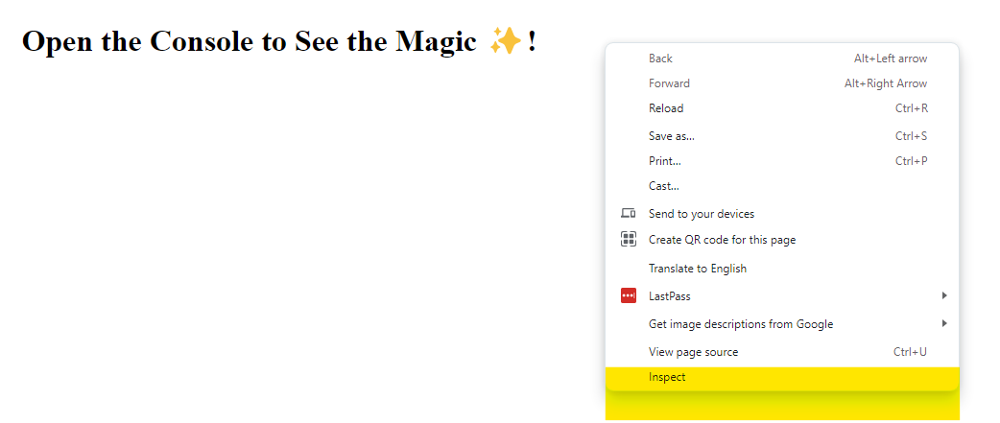
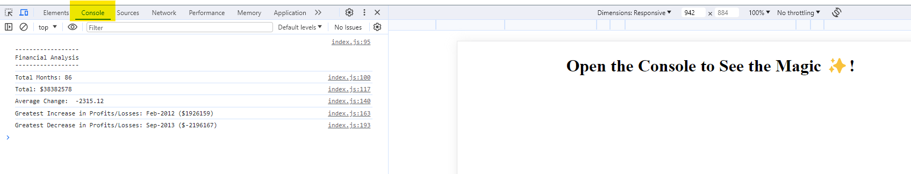

# Console-Finances
Week 4 Introduction to Javascript assignment : Console Finances code which analyses the financial records of a company

## Description
This is an application built in `Javscript` which analyses the finances of a company over a period of time and outputs the profits and losses in the console.

## How to access the application
To access the application, click on the link below
[Financial Analysis of Company using Browser Dev Tool Console](https://ksencherey.github.io/Console-Finances/)

Once the application is accessed via the `URL`, right click on the browser window and select inspect.

This will open the development tool in the browser. Navigate to the console to see the display of the company's financial analysis

### Technologies Used

HTML - `Hyper Text Markup Language` was used to display a text of how to access the application in the console of the browser.

JS - `JavaScript` was used to calculate and display finances of the company in the browser Dev tool console.

### Further Work
As knowledge in Javascript expands during the bootcamp, this application will be developed to have a front end where the output of the analysis will be displayed.